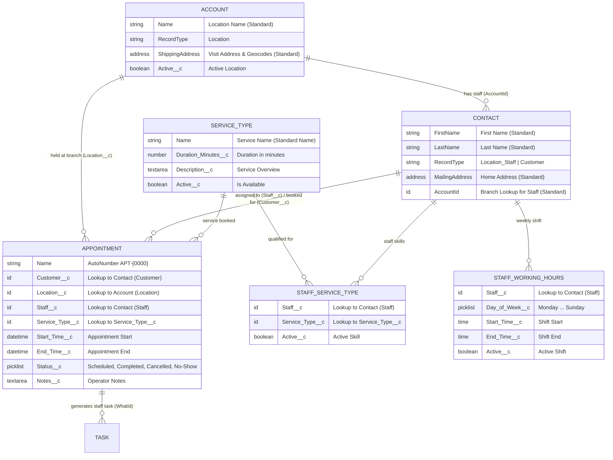

# Salesforce Appointment Scheduler

> A multi-location service appointment booking platform built on the Salesforce platform, engineered to showcase enterprise architecture patterns and developer-first workflows powered by **[Hob: The Salesforce House-Elf](https://github.com/keesjankoster/hob)** (`hob`).

---

## 📖 Documentation & Architecture Series

This repository accompanies a step-by-step technical article series exploring modern Salesforce DX development, least-privilege security, test hygiene, and CLI scaffolding:

| Part | Title | Focus & Hob Commands |
| :---: | :--- | :--- |
| **[Part 1](documentation/part1.md)** | **[Eliminating Salesforce XML Fatigue — CLI Schema Scaffolding with Hob](documentation/part1.md)** | Foundational data model, native compound geolocation, and CLI schema generation (`hob create object`, `hob create field`). |
| **[Part 2](documentation/part2.md)** | **[Instant Least-Privilege Access — Generating Permission Sets with Hob](documentation/part2.md)** | Moving beyond profiles, multi-object security scaffolding, and FLS nuances (`hob create permset`). |
| **[Part 3](documentation/part3.md)** | **[Standardizing Test Hygiene — In-Memory vs DML Factories with Hob](documentation/part3.md)** | Taming governor limits, in-memory (`build`) vs database (`create`) factories, and demo seeding (`hob create factory`, `hob seed init`). |
| *Part 4* | *High-Velocity TDD: Companion Test Scaffolding with Hob* | *(In Progress)* Service layer: `CustomerService`, `LocationService`, `AvailabilityService`, and `AppointmentService` (`hob create apex --with-test`). |
| *Part 5* | *Architecture by Default: Separation of Concerns with Hob Triggers* | *(Upcoming)* `AppointmentTriggerHandler`, automated email notifications, and standard `Task` generation (`hob create trigger`). |
| *Part 6* | *Building Modern Lightning UIs Fast: Scaffolded LWCs with Hob* | *(Upcoming)* Multi-step booking wizard (`appointmentWizard`) and Lightning App page (`hob create lwc`). |
| *Part 7* | *One Command to Rule Them All: The Complete Dev Org Setup with Hob* | *(Upcoming)* End-to-end scratch org creation, deployment, and testing (`hob scratch new`, `hob hearth`, `hob scratch purge`). |

---

## 🏛️ System Architecture

The **Salesforce Appointment Scheduler** is designed for headquarters coordination teams to manage customer service inquiries. The system identifies the nearest qualified service branch using customer postal codes and schedules appointments based on real-time staff schedules and existing bookings.

### Maximizing Native Salesforce Platform Capabilities

To avoid reinventing standard CRM capabilities, the architecture leverages:
* **`Account.ShippingAddress`** (`ShippingStreet`, `ShippingCity`, `ShippingPostalCode`): Represents the **Branch Visit Address** and utilizes native platform geocoding (`ShippingLatitude` and `ShippingLongitude`) for direct SOQL `DISTANCE()` calculations without custom mathematical Apex routines.
* **`Contact.MailingAddress`**: Represents the **Customer Home Address**.
* **`Contact.AccountId`**: Represents the branch affiliation for **Location Staff**.
* **`Task`** (Standard Activity): Automatically generated upon appointment creation for staff follow-up (`WhatId` &rarr; `Appointment__c`, `WhoId` &rarr; `Contact`).

### Entity Relationship Diagram (ERD)



---

## 📦 What Has Been Built So Far

### 1. Data Model (`force-app/main/default/objects/`)
* **Custom Objects**:
  * [`Appointment__c`](force-app/main/default/objects/Appointment__c/Appointment__c.object-meta.xml): Core transaction entity with AutoNumber `APT-{0000}`, status management, and lookups to Customer, Location, Staff, and Service Type.
  * [`Service_Type__c`](force-app/main/default/objects/Service_Type__c/Service_Type__c.object-meta.xml): Catalog of available services with configurable durations.
  * [`Staff_Service_Type__c`](force-app/main/default/objects/Staff_Service_Type__c/Staff_Service_Type__c.object-meta.xml): Junction linking Staff to qualified Service Types.
  * [`Staff_Working_Hours__c`](force-app/main/default/objects/Staff_Working_Hours__c/Staff_Working_Hours__c.object-meta.xml): Weekly shift schedules using native `Time` fields.
* **Standard Object Extensions**:
  * `Account`: `Active__c` toggle and `Location` Record Type.
  * `Contact`: `Customer` and `Location_Staff` Record Types.

### 2. Security & Least-Privilege Authorization (`force-app/main/default/permissionsets/`)
* **[`Appointment_Scheduler_Operator`](force-app/main/default/permissionsets/Appointment_Scheduler_Operator.permissionset-meta.xml)**:
  * Full CRUD & View All permissions on `Appointment__c`, `Service_Type__c`, `Staff_Service_Type__c`, and `Staff_Working_Hours__c`.
  * Read, Create, Edit, and View All access on standard `Account`, `Contact`, and `Task`.
  * Explicit Field-Level Security (FLS) for optional custom fields.
  * Record Type visibility for `Account.Location`, `Contact.Customer`, and `Contact.Location_Staff`.

### 3. Apex Test Data Factories (`force-app/main/default/classes/`)
Standardized test factories implementing the **In-Memory (`build`) vs. Database (`create`)** pattern to prevent test suite bloat and governor limit exhaustion:
* [`AccountDataFactory.cls`](force-app/main/default/classes/AccountDataFactory.cls) &mdash; Location branch accounts with geolocation coordinates.
* [`ContactDataFactory.cls`](force-app/main/default/classes/ContactDataFactory.cls) &mdash; Dedicated builders for Customers and Location Staff.
* [`Service_TypeDataFactory.cls`](force-app/main/default/classes/Service_TypeDataFactory.cls) &mdash; Service catalog records with required duration defaults.
* [`Staff_Service_TypeDataFactory.cls`](force-app/main/default/classes/Staff_Service_TypeDataFactory.cls) &mdash; Junction qualification records.
* [`Staff_Working_HoursDataFactory.cls`](force-app/main/default/classes/Staff_Working_HoursDataFactory.cls) &mdash; Time shifts and weekly Monday–Friday schedule helpers (`createWeeklySchedule()`).
* [`AppointmentDataFactory.cls`](force-app/main/default/classes/AppointmentDataFactory.cls) &mdash; AutoNumber-aware appointment records with full relationship wiring.

### 4. Scratch Org Demo Seed Fixtures (`scripts/apex/` & `data/`)
* **[`scripts/apex/seed.apex`](scripts/apex/seed.apex)**: Executable anonymous Apex script planting:
  * 3 Central London branches (Central London, West End, Kensington) with real UK postcodes and coordinates.
  * 3 qualified staff members linked to branches.
  * 2 customers with address data.
  * 3 service types (30 min, 60 min, 120 min).
  * Staff qualifications and full Mon–Fri 09:00–17:00 schedules.
  * An active starter appointment for immediate testing.
* **[`data/data-plan.json`](data/data-plan.json)**: JSON tree data plans for automated org data seeding.

---

## 🚀 Quick Start & Developer Guide

### 1. Deploy Metadata
Deploy the metadata to your active scratch org or sandbox:
```bash
hob deploy devhub
# or using Salesforce CLI:
sf project deploy start
```

### 2. Assign Permissions
Assign the operator permission set to your user:
```bash
sf org assign permset -n Appointment_Scheduler_Operator
```

### 3. Seed Realistic Demo Data
Seed demo branch locations, staff, schedules, and services:
```bash
sf apex run --file scripts/apex/seed.apex
# or using Hob's seed command:
hob seed --apex scripts/apex/seed.apex
```

### 4. Open Org in Browser
```bash
hob open
# or:
sf org open
```
