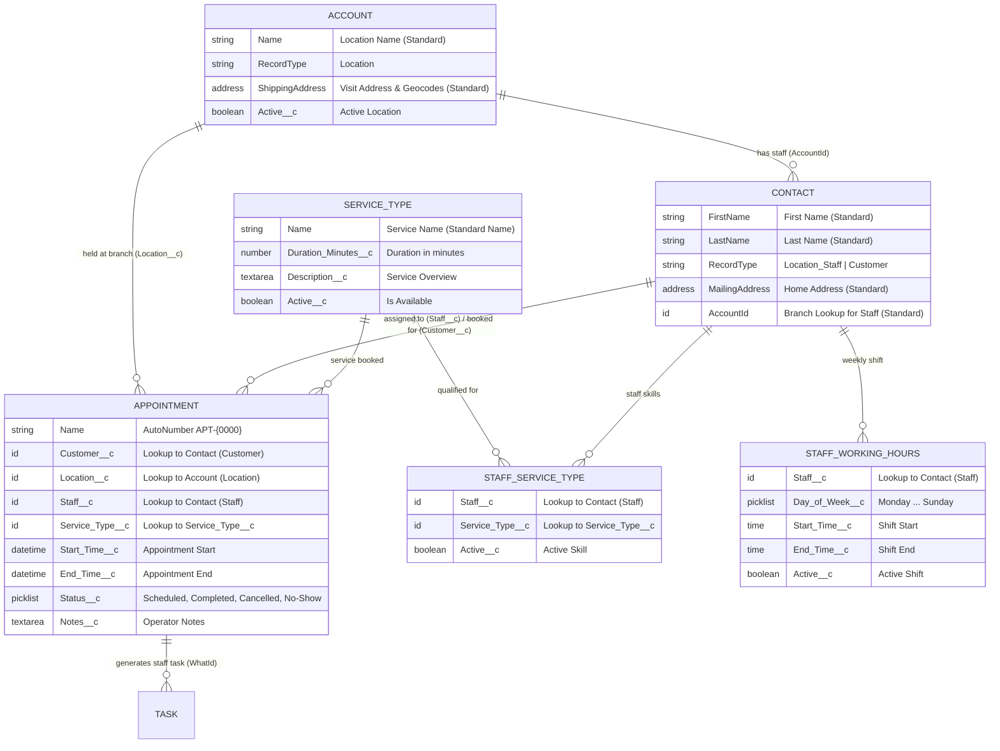

# Part 1: Eliminating Salesforce XML Fatigue — CLI Schema Scaffolding with Hob

> *Building a real-world enterprise appointment booking data model from the terminal without opening the Object Manager wizard or writing hundreds of lines of boilerplate XML.*

---

## Introduction: The "Setup Click Fatigue" Problem

Every Salesforce developer and architect has lived this scenario: you sit down with a clean domain model for a new business capability. You have five objects to build, a dozen lookups, picklists, and autonumber fields. 

In traditional Salesforce development, you face an unappealing choice:
1. **The Object Manager Click-a-thon**: Navigate to Salesforce Setup in a browser, click *New Custom Object*, wait for the page to load, fill out 7 fields across 3 screens, repeat for every field, choose picklist values line by line, assign profiles, and add to page layouts. For 4 custom objects and 20 fields, you are looking at 45–60 minutes of repetitive clicking and browser latency.
2. **Manual XML Crafting**: Switch to your IDE, create directory trees, copy-paste `.field-meta.xml` files from another project, manually edit `<label>`, `<precision>`, `<scale>`, `<referenceTo>`, and `<relationshipName>`, praying you didn't leave a typo in a closing tag that will only fail on your next deployment.

There had to be a faster, cleaner, developer-first way.

In this series, we build the **Salesforce Appointment Scheduler**—a multi-location appointment booking platform designed for headquarters staff to schedule regional appointments based on customer proximity, staff qualifications, and real-time calendar availability. 

More importantly, we use this project to put **Hob: The Salesforce House-Elf** (`hob`) through its paces. Hob is a developer productivity CLI designed to eliminate developer friction in Salesforce DX.

In this first installment, we will scaffold the entire domain model in under three minutes from the command line.

---

## The Architecture: Maximizing Standard Salesforce

Before running a single command, good architecture demands that we ask: *What can standard Salesforce do for us out of the box?*

Too many custom apps reinvent standard CRM concepts: custom address text fields, custom coordinates, custom tasks. In our architecture, we maximize standard Salesforce platform capabilities:

1. **`Account` (`RecordType: Location`)**: Represents branch locations. We use the standard compound field **`ShippingAddress`** (`ShippingStreet`, `ShippingCity`, `ShippingPostalCode`), which provides native platform geocoding (`ShippingLatitude` and `ShippingLongitude`). This allows us to use native SOQL `DISTANCE()` queries without custom mathematical Apex routines.
2. **`Contact` (`RecordType: Location_Staff`)**: Represents qualified service staff linked directly to their branch location using the standard **`AccountId`** lookup.
3. **`Contact` (`RecordType: Customer`)**: Represents customers using standard **`MailingAddress`**, **`Email`**, and **`Phone`**.
4. **`Task` (Standard Activity)**: When an appointment is scheduled, follow-up actions and reminders are dispatched as native Salesforce `Task` records linked via `WhatId` (Appointment) and `WhoId` (Staff Contact).

### The Complete Entity Relationship Diagram (ERD)



---

## Scaffolding the Schema with Hob

Let's look at how fast this schema comes together using `hob create object` and `hob create field`.

### 1. `Service_Type__c` (Catalog of Services)

First, we create the catalog of services (e.g., Oil Change, Diagnostic, Consultation) with duration and descriptions:

```bash
# Create the custom object
hob create object Service_Type \
  -l "Service Type" \
  -p "Service Types" \
  -d "Types of services offered at locations"

# Add duration in minutes (Required Number)
hob create field Service_Type__c Duration_Minutes \
  -t Number \
  --precision 4 --scale 0 \
  -r \
  -l "Duration (Minutes)" \
  -d "Duration of service in minutes"

# Add long description
hob create field Service_Type__c Description \
  -t LongTextArea \
  --length 32768 \
  -l "Description" \
  -d "Description of the service offered"

# Add active status flag
hob create field Service_Type__c Active \
  -t Checkbox \
  --default-value true \
  -l "Active" \
  -d "Indicates if this service type is active"
```

Notice what just happened:
- No manual file creation or XML indentation.
- Hob automatically handled the `__c` suffix, created the `force-app/main/default/objects/Service_Type__c/` structure, and placed each field XML into its respective `fields/` folder with valid Salesforce DX metadata.

### 2. Extending `Account` for Locations

Branches are standard Accounts. We only need an `Active__c` toggle:

```bash
hob create field Account Active \
  -t Checkbox \
  --default-value true \
  -l "Active" \
  -d "Indicates if this account/location is active"
```

### 3. `Staff_Service_Type__c` (Junction Object for Skills)

Not all staff members perform every service. We model this with a clean junction object linking `Contact` (Staff) to `Service_Type__c`:

```bash
# Create junction object
hob create object Staff_Service_Type \
  -l "Staff Service Type" \
  -p "Staff Service Types" \
  -d "Junction linking Staff (Contact) to Service Types they can handle"

# Lookup to Contact (Staff)
hob create field Staff_Service_Type__c Staff \
  -t Lookup \
  --reference-to Contact \
  --relationship-name Staff_Service_Types \
  --relationship-label "Staff Service Types" \
  -r \
  -l "Staff" \
  -d "Staff member qualified for this service"

# Lookup to Service Type
hob create field Staff_Service_Type__c Service_Type \
  -t Lookup \
  --reference-to Service_Type__c \
  --relationship-name Staff_Service_Types \
  --relationship-label "Staff Service Types" \
  -r \
  -l "Service Type" \
  -d "Service type the staff member is qualified for"

# Active indicator
hob create field Staff_Service_Type__c Active \
  -t Checkbox \
  --default-value true \
  -l "Active" \
  -d "Indicates if this staff qualification is active"
```

Lookups in Salesforce metadata usually require four distinct tags: `<referenceTo>`, `<relationshipName>`, `<relationshipLabel>`, and `<deleteConstraint>`. Hob exposes these as straightforward flags and handles all the XML boilerplate behind the scenes.

### 4. `Staff_Working_Hours__c` (Weekly Shift Schedule)

To calculate slot availability in real time, the scheduling engine needs to know when staff members work.

```bash
# Create shift schedule object
hob create object Staff_Working_Hours \
  -l "Staff Working Hours" \
  -p "Staff Working Hours" \
  -d "Weekly working schedule for Location Staff"

# Lookup to Staff Contact
hob create field Staff_Working_Hours__c Staff \
  -t Lookup \
  --reference-to Contact \
  --relationship-name Staff_Working_Hours \
  --relationship-label "Staff Working Hours" \
  -r \
  -l "Staff" \
  -d "Staff member for these working hours"

# Day of week picklist
hob create field Staff_Working_Hours__c Day_of_Week \
  -t Picklist \
  --values Monday Tuesday Wednesday Thursday Friday Saturday Sunday \
  -r \
  -l "Day of Week" \
  -d "Day of the week"

# Active flag
hob create field Staff_Working_Hours__c Active \
  -t Checkbox \
  --default-value true \
  -l "Active" \
  -d "Indicates if this schedule slot is active"
```

> **Developer Note on `Time` fields:** `Start_Time__c` and `End_Time__c` use Salesforce's native `Time` type (e.g. `09:00:00.000Z`). We created these XML definitions directly in `fields/Start_Time__c.field-meta.xml` and `fields/End_Time__c.field-meta.xml`.

### 5. `Appointment__c` (The Core Booking Entity)

Finally, we scaffold the core transaction record. We want appointments to use auto-numbering with the format `APT-{0000}`:

```bash
# Create Appointment with AutoNumber name field
hob create object Appointment \
  -l "Appointment" \
  -p "Appointments" \
  --name-field-type AutoNumber \
  --name-field-label "Appointment Number" \
  --auto-number-format "APT-{0000}" \
  -d "Service appointment booked for a customer at a location"

# Lookups
hob create field Appointment__c Customer \
  -t Lookup \
  --reference-to Contact \
  --relationship-name Appointments_Customer \
  --relationship-label "Appointments (Customer)" \
  -r -l "Customer" -d "The customer who booked the appointment"

hob create field Appointment__c Location \
  -t Lookup \
  --reference-to Account \
  --relationship-name Appointments \
  --relationship-label "Appointments" \
  -r -l "Location" -d "The location where the appointment takes place"

hob create field Appointment__c Staff \
  -t Lookup \
  --reference-to Contact \
  --relationship-name Appointments_Staff \
  --relationship-label "Appointments (Staff)" \
  -r -l "Staff" -d "The staff member assigned to the appointment"

hob create field Appointment__c Service_Type \
  -t Lookup \
  --reference-to Service_Type__c \
  --relationship-name Appointments \
  --relationship-label "Appointments" \
  -r -l "Service Type" -d "The service type booked"

# DateTimes & Status
hob create field Appointment__c Start_Time \
  -t DateTime -r -l "Start Time" -d "Appointment start date and time"

hob create field Appointment__c End_Time \
  -t DateTime -r -l "End Time" -d "Appointment end date and time"

hob create field Appointment__c Status \
  -t Picklist \
  --values Scheduled Completed Cancelled No-Show \
  -r -l "Status" -d "Status of the appointment"

hob create field Appointment__c Notes \
  -t LongTextArea --length 32768 \
  -l "Notes" -d "Operator notes or special customer instructions"
```

---

## Architectural Highlight: Why Native Geolocation Matters

One of the highlights of this data model is how branch location distance calculations work. Because we chose standard `Account.ShippingAddress`, our upcoming `LocationService` can find the nearest branches to any customer postal code with a clean, native SOQL query:

```sql
SELECT Id, Name, ShippingStreet, ShippingCity, ShippingPostalCode,
       DISTANCE(ShippingAddress, GEOLOCATION(:customerLat, :customerLon), 'km') dist
FROM Account
WHERE RecordType.DeveloperName = 'Location'
  AND Active__c = true
ORDER BY DISTANCE(ShippingAddress, GEOLOCATION(:customerLat, :customerLon), 'km') ASC
LIMIT 5
```

No external microservices. No custom decimal math in Apex loops. Just clean platform capabilities leveraged to their fullest.

---

## Reflections & CLI Feedback: The DX Verdict

Scaffolding this complete architecture with Hob took under 3 minutes of terminal execution. 

### What Shined
1. **Zero Context Switching**: You remain in your terminal / IDE without waiting for Salesforce Setup pages to load.
2. **Predictable Conventions**: Flags like `--values` for picklists, `--reference-to` for lookups, and auto-appended `__c` save significant keystrokes.
3. **Deterministic Output**: Every field was immediately ready for version control (`git commit -m "Create objects and fields"`), free from browser session artifacts.

### Opportunities for Hob's Backlog
Working through this real-world implementation highlighted two concrete feature requests for Hob:
1. **Native `Time` field support**: Adding `-t Time` directly to `hob create field` would eliminate manual touch-ups for shift schedules.
2. **`hob create recordtype`**: A dedicated command to scaffold Record Type definitions (`Location`, `Customer`, `Location_Staff`) without manual XML authoring.

---

## What's Next in Part 2

With our foundation in place, we need to secure it. In **Part 2**, we will explore:
* **"Instant Least-Privilege Access: Generating Permission Sets with Hob"**
* Scaffolding the `Appointment_Scheduler_Operator` permission set via `hob create permset`.
* Setting up granular Field-Level Security (FLS) and Object permissions cleanly from the CLI.

Stay tuned!
