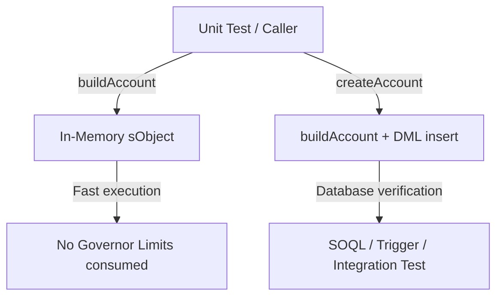

# Part 3: Standardizing Test Hygiene — In-Memory vs DML Factories with Hob

> *Taming Apex test suite bloat and governor limits using standardized test data factories and scratch org seed fixtures.*

---

## Introduction: The Apex Test Data Crisis

In Salesforce development, poor test data hygiene is one of the leading causes of developer frustration. Almost every established Salesforce codebase suffers from at least one of these symptoms:

1. **The 3,000-line `TestUtility` Monolith**: A single, sprawling utility class where every developer has added their own bespoke `createAccountWithBillingAndPhone()` or `createStaffMemberV2()` methods. No one knows which method to use, leading to duplicate helpers and brittle tests.
2. **DML Everywhere, All the Time**: Developers insert 50 records in `@TestSetup` or inside individual unit test methods just to test a simple utility method or validation rule. The result? Test suites that take 45+ minutes to run in CI/CD pipelines, frequently tripping CPU time limits, SOQL limits, and row-locking errors.
3. **The Scratch Org Desert**: After spinning up a fresh scratch org, developers find an empty database. Without easy, repeatable seed data, manual setup is required before any meaningful manual testing or UI demo can occur.

In **Step 3** of our **Salesforce Appointment Scheduler** project, we solve these problems right from the start using **Hob: The Salesforce House-Elf** (`hob create factory` and `hob seed init`).

---

## The Pattern: Separation of In-Memory (`build`) and Database (`create`)

Modern Apex testing distinguishes between two types of tests:
* **Unit Tests (Fast, In-Memory)**: Testing business logic, algorithms, date math, or data transformations. These tests should *never* perform DML. They construct sObjects in memory and run in milliseconds.
* **Integration Tests (Database)**: Testing triggers, SOQL queries, roll-up summaries, and platform events. These tests require actual database persistence.

Hob's test factory generator embeds this pattern directly into every factory it scaffolds:



Every factory generated by Hob exposes four symmetrical entry points:
1. `build<SObject>()` &mdash; Returns an in-memory sObject with sensible defaults (No DML).
2. `build<SObject>(fieldOverrides)` &mdash; In-memory sObject with custom field overrides.
3. `create<SObject>()` &mdash; Inserts a single record into the database and returns it.
4. `create<SObject>(fieldOverrides)` &mdash; Inserts a record with custom field overrides.
5. Bulk equivalents: `build<SObject>List(count)` and `create<SObject>List(count)`.

---

## Scaffolding the Factories with Hob

With 6 core entities in our domain model, we scaffolded dedicated factories for each in seconds:

```bash
hob create factory Account
hob create factory Contact
hob create factory Service_Type__c
hob create factory Staff_Service_Type__c
hob create factory Staff_Working_Hours__c
hob create factory Appointment__c
```

### The Terminal Output

```
  🧙 Hob — The Salesforce House-Elf 🧦
  "Loyal, quiet, and tireless assistance for your Salesforce Development."

✔ Created Test Data Factory 'AppointmentDataFactory' for 'Appointment__c'

🧦 Hob crafted your Apex Test Data Factory with clean build vs create separation:

  Class:        AppointmentDataFactory.cls
  Target Object:Appointment__c
  Directory:    force-app/main/default/classes

  Sample Test Usage:
    // Fast in-memory unit test record:
    Appointment__c r1 = AppointmentDataFactory.buildAppointment();
    // Integration test record with DML:
    Appointment__c r2 = AppointmentDataFactory.createAppointment();
    // Bulk insertion:
    List<Appointment__c> list1 = AppointmentDataFactory.createAppointmentList(5);
```

---

## Real-World Nuances & Domain Refinements

Hob gives you a production-ready architectural scaffold. To make these factories truly shine for the **Appointment Scheduler**, we tailored each class with domain-specific intelligence:

### 1. Handling AutoNumber Fields (`Appointment__c`)
`Appointment__c.Name` is an AutoNumber field (`APT-{0000}`). In Apex, trying to set `Name = 'Test...'` on an AutoNumber custom object causes a compilation or runtime error because the field is read-only. We omitted `Name` assignments and pre-populated the required DateTime and Status fields:

```apex
public static Appointment__c buildAppointment(Map<String, Object> fieldOverrides) {
    DateTime defaultStart = DateTime.now().addDays(1);
    Appointment__c record = new Appointment__c(
        Start_Time__c = defaultStart,
        End_Time__c = defaultStart.addHours(1),
        Status__c = 'Scheduled',
        Notes__c = 'Test appointment notes ' + index
    );
    index++;
    applyOverrides(record, fieldOverrides);
    return record;
}
```

### 2. Multi-RecordType Awareness (`ContactDataFactory` & `AccountDataFactory`)
Our domain model relies on distinct Record Types:
* `Account` &rarr; `Location`
* `Contact` &rarr; `Customer` vs. `Location_Staff`

We enriched `ContactDataFactory` with specialized builder methods:
```apex
// Default build: Customer with home address
Contact customer = ContactDataFactory.buildContact();

// Staff builder: Pre-linked to branch Account
Contact staff = ContactDataFactory.buildStaffContact(branchAccountId, null);
```

### 3. Weekly Schedule Generation (`Staff_Working_HoursDataFactory`)
Testing slot availability algorithms requires realistic working hours across days of the week. We added a convenient helper that seeds a full Monday–Friday shift schedule with one call:

```apex
// Generates Mon-Fri 09:00 - 17:00 shifts in one line
List<Staff_Working_Hours__c> weeklyShifts = 
    Staff_Working_HoursDataFactory.createWeeklySchedule(staffContact.Id);
```

---

## Seeding Scratch Orgs: `hob seed init`

Unit tests handle automation, but developers also need rich demo data when opening a scratch org in the browser or validating LWC components.

Hob includes built-in seed management. Running `hob seed init` scaffolded our seed fixtures:

```bash
hob seed init
```

```
✔ Scaffolded 4 starter test data fixture(s):
  • scripts/apex/seed.apex
  • data/data-plan.json
  • data/Accounts.json
  • data/Contacts.json
```

We tailored `scripts/apex/seed.apex` to plant a complete, realistic Appointment Scheduler ecosystem:
* **Nationwide Branch Coverage (London, Birmingham, Manchester, Leeds)**:
  * **London Flagship** (EC2V 6DN, Cheapside)
  * **Birmingham Colmore** (B3 2QD, Colmore Row)
  * **Manchester Deansgate** (M3 2BB, Deansgate)
  * **Leeds Park Row** (LS1 5HD, Park Row)  
  All seeded with standard `ShippingAddress` compound geocodes (`ShippingLatitude` and `ShippingLongitude`) to enable cross-country SOQL `DISTANCE()` queries.
* **Realistic Staffing (Full-Time & Part-Time Mix)**:
  * **Full-time specialists** across all regional hubs (Alice in London, Bob in Birmingham, Charlie in Manchester, Fiona in Leeds) covering core weekday shifts.
  * **Part-time specialists** with realistic shift models:
    * *Morning shifts*: David in London (Mon/Wed/Fri 09:00–13:00) and George in Leeds (Wed–Fri 08:30–13:30).
    * *Afternoon shifts*: Liam in Manchester (Mon–Wed 12:30–17:00).
    * *Specific working days*: Priya in Birmingham (Tue/Thu 09:00–17:00).
* **Regional Customers**: Distributed strategically across the UK near each regional hub (London, Solihull/Birmingham, Salford/Manchester, Leeds) with genuine UK postal codes.
* **Service Catalog & Tiered Qualifications**: 30-min Consultation, 60-min Standard Service, and 120-min Comprehensive Inspection, mapped via junction records to technician skills.
* **Regional Starter Appointments**: Active upcoming bookings in London and Manchester to test slot conflict detection and distance matching.

Whenever a developer spins up a new scratch org, running `hob seed` or executing `seed.apex` immediately turns an empty org into a fully functional demo environment.

---

## DX Verdict & Tool Feedback

### What Shined
1. **Clean Architectural Default**: Moving every object to its own `[SObject]DataFactory` completely eliminates the monolithic `TestUtility` anti-pattern.
2. **The Override Map Pattern**: The `applyOverrides(record, fieldOverrides)` method provides total flexibility without needing 20 constructor permutations.
3. **Seed Scaffolding**: Having `hob seed init` generate both anonymous Apex and JSON data plan structures bridges the gap between unit test factories and developer demo environments.

### Opportunities for Hob's Backlog
1. **AutoNumber Field Detection**: Hob could check if the sObject has an AutoNumber name field and omit `Name = ...` in the generated template.
2. **Template Variable Scoping**: A minor template glitch where `baseName` was referenced in the assignment without a corresponding variable declaration has been resolved in our classes, but can be polished in Hob's template engine.

---

## What's Next in Part 4

Now that our data model is secured (Part 2) and backed by robust, high-performance test factories (Part 3), we are ready for the core engine!

In **Part 4**, we will explore:
* **"High-Velocity TDD: Companion Test Scaffolding with Hob"**
* Using `hob create apex <Name> --with-test` to scaffold service classes and test fixtures side by side.
* Building `CustomerService`, `LocationService` (native `DISTANCE()` + Haversine fallback), `AvailabilityService` (slot calculations), and `AppointmentService` (booking & concurrency protection).
