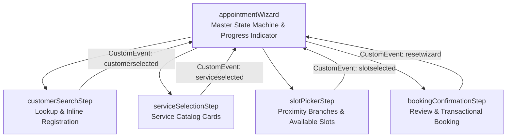

# Part 6: Building Modern Lightning UIs Fast — Scaffolded LWCs with Hob

> *From zero to a responsive, multi-step appointment booking wizard: target-aware LWC scaffolding, event-driven state orchestration, and Lightning App packaging.*

---

## Introduction: The Frontend Friction in Salesforce DX

In Parts 1 through 5, we engineered the backend of our **Salesforce Appointment Scheduler**:
- Custom data schema and native geolocation ([Part 1](part1.md))
- Least-privilege permission sets ([Part 2](part2.md))
- Dual in-memory and database test factories ([Part 3](part3.md))
- Enterprise Apex service engines with row-locking concurrency ([Part 4](part4.md))
- Trigger-driven Task generation and email notifications ([Part 5](part5.md))

Now, headquarters operators and call center agents need a user interface. They need to find a customer, pick a service, discover the nearest branch, select an open time slot, and confirm the booking in under 60 seconds.

Historically, building composite Lightning Web Components (LWC) in Salesforce DX has carried noticeable friction:
1. **Three-File Boilerplate**: Every component requires an `.html`, `.js`, and `-meta.xml` file.
2. **Metadata XML Hell**: Manually typing XML namespaces, `isExposed = true`, `<targets>`, and `<targetConfigs>` for App Pages, Record Pages, or Lightning Tabs frequently leads to deployment errors due to simple typos.
3. **Monolithic Component Sprawl**: When creating a multi-step flow, developers often dump hundreds of lines of HTML into a single component rather than modularizing into clean subcomponents, because creating each subcomponent by hand is cumbersome.

In **Step 6**, we use **[Hob: The Salesforce House-Elf](https://github.com/keesjankoster/hob)** (`hob create lwc`) to scaffold our UI components in seconds, wire them to our Apex service layer, and package the complete experience into a dedicated Lightning App.

---

## Scaffolding LWCs with Hob

Hob eliminates manual LWC boilerplate with target-aware component scaffolding:

```bash
hob create lwc appointmentWizard -t app tab
```

### The Terminal Output

```
  🧙 Hob — The Salesforce House-Elf 🧦
  "Loyal, quiet, and tireless assistance for your Salesforce Development."

✔ Created Lightning Web Component 'appointmentWizard'

🧦 Hob prepared your LWC with target configuration:

  Component: force-app/main/default/lwc/appointmentWizard/appointmentWizard.js
  Template:  force-app/main/default/lwc/appointmentWizard/appointmentWizard.html
  Metadata:  force-app/main/default/lwc/appointmentWizard/appointmentWizard.js-meta.xml
  Targets:   lightning__AppPage, lightning__Tab
```

### Automatic Target Configuration (`js-meta.xml`)

Hob automatically handles the exposure flags and target definitions in [`appointmentWizard.js-meta.xml`](../force-app/main/default/lwc/appointmentWizard/appointmentWizard.js-meta.xml):

```xml
<?xml version="1.0" encoding="UTF-8"?>
<LightningComponentBundle xmlns="http://soap.sforce.com/2006/04/metadata">
    <apiVersion>62.0</apiVersion>
    <isExposed>true</isExposed>
    <targets>
        <target>lightning__AppPage</target>
        <target>lightning__Tab</target>
    </targets>
</LightningComponentBundle>
```

For child subcomponents that do not need to be exposed as standalone tabs or page builder elements, we scaffold them without target flags:

```bash
hob create lwc customerSearchStep
hob create lwc serviceSelectionStep
hob create lwc slotPickerStep
hob create lwc bookingConfirmationStep
```

When no `-t` flag is passed, Hob correctly defaults `isExposed` to `false`, keeping our component surface clean and encapsulated.

---

## UI Architecture: Container & Subcomponent Pattern

Rather than a monolithic 1,000-line LWC, the booking wizard is designed around the **Container Component Pattern**:



### 1. State Orchestration in `appointmentWizard`

The parent component ([`appointmentWizard.js`](../force-app/main/default/lwc/appointmentWizard/appointmentWizard.js)) maintains the single source of truth:
- `currentStep`: Controls which child step is rendered.
- `selectedCustomer`: Selected customer record.
- `selectedService`: Selected service type.
- `selectedLocation`: Chosen branch location (with distance calculation).
- `selectedSlot`: Chosen time slot and specialist.
- `bookingNotes`: Operator notes.

It coordinates progress via Salesforce's native `lightning-progress-indicator`:

```html
<lightning-progress-indicator current-step={currentStep} type="path" variant="base">
    <lightning-progress-step label="Customer" value="1"></lightning-progress-step>
    <lightning-progress-step label="Service" value="2"></lightning-progress-step>
    <lightning-progress-step label="Location & Slot" value="3"></lightning-progress-step>
    <lightning-progress-step label="Confirm" value="4"></lightning-progress-step>
</lightning-progress-indicator>
```

### 2. Live Context Breadcrumb

Whenever a customer or service is chosen, a sticky context bar appears above the steps, giving the operator instant visibility into what has been selected:

```html
<template if:true={hasContext}>
    <div class="context-bar slds-m-bottom_medium slds-p-around_small slds-theme_shade slds-box slds-box_x-small">
        <template if:true={selectedCustomer}>
            <span class="context-pill">
                <lightning-icon icon-name="standard:contact" size="x-small"></lightning-icon>
                <strong>Customer:</strong> {selectedCustomer.Name} ({selectedCustomer.MailingPostalCode})
            </span>
        </template>
        <template if:true={selectedService}>
            <span class="context-pill">
                <lightning-icon icon-name="standard:service_resource" size="x-small"></lightning-icon>
                <strong>Service:</strong> {selectedService.Name} ({selectedService.Duration_Minutes__c} mins)
            </span>
        </template>
    </div>
</template>
```

---

## Step-by-Step Component Implementation

### Step 1: Customer Search & Inline Creation ([`customerSearchStep`](../force-app/main/default/lwc/customerSearchStep/))

Call center operators handle two scenarios: existing customers calling back, or first-time customers needing instant registration.

`customerSearchStep` handles both in a side-by-side card layout:
1. **Search Pane**: Dispatches to `CustomerService.searchCustomers({ searchTerm, postalCode })` matching on Name, Email, Phone, or Postal Code. Results display matching cards with click-to-select actions.
2. **Quick Registration Form**: Dispatches to `CustomerService.createCustomer` to register a new customer in a single click without leaving the booking screen.

When a customer is selected or registered, the component fires a clean custom event:
```javascript
this.dispatchEvent(new CustomEvent('customerselected', {
    detail: customer,
    bubbles: true,
    composed: true
}));
```

### Step 2: Service Selection ([`serviceSelectionStep`](../force-app/main/default/lwc/serviceSelectionStep/))

Connects directly to `AvailabilityService.getActiveServiceTypes` to render the catalog of available appointment offerings.

Features:
- Responsive grid of selectable service cards (`slds-col slds-size_1-of-1 slds-medium-size_1-of-3`).
- Service duration badges (`30 mins`, `60 mins`, `120 mins`) using `slds-badge slds-badge_lightest`.
- Hover and focus states styled with modern box-shadow elevation and micro-transitions.

### Step 3: Location Discovery & Slot Selection ([`slotPickerStep`](../force-app/main/default/lwc/slotPickerStep/))

This is where our Step 4 Apex engines shine in real time:

1. **Proximity-Ranked Branches**:
   - As soon as the step loads, it invokes `LocationService.findNearestLocations` using the selected customer's postal code.
   - Locations are ordered by distance (e.g. `2.4 km away`), automatically pre-selecting the nearest branch.
2. **Shift-Aware Slot Picker**:
   - The operator chooses a booking date (defaults to tomorrow).
   - The component calls `AvailabilityService.getAvailableSlots({ locationId, serviceTypeId, slotDate })`.
   - The response renders interactive time slot pills displaying the start time and the scheduled specialist.
3. **Operator Booking Notes**:
   - Includes a textarea for special customer requirements or instructions.

### Step 4: Summary Recap & Transactional Booking ([`bookingConfirmationStep`](../force-app/main/default/lwc/bookingConfirmationStep/))

Before committing to the database, the operator reviews all booking details in a structured card:
- Customer details and contact information.
- Selected branch location, address, and specialist.
- Date, start time, end time, and duration.
- Special notes.

When the operator clicks **"Confirm & Book Appointment"**:
1. Invokes `AppointmentService.bookAppointment` asynchronously.
2. Under the hood, this triggers:
   - `FOR UPDATE` row-locking concurrency protection ([Part 4](part4.md)).
   - Double-booking conflict validation.
   - Automatic standard `Task` creation for the specialist ([Part 5](part5.md)).
   - Customer and staff confirmation emails ([Part 5](part5.md)).
3. Upon success, the UI swaps into a success state featuring the AutoNumber appointment reference (`APT-0001`) and a **"Book Another Appointment"** action to reset the wizard for the next caller.

---

## Packaging the Experience: Custom Tabs & Lightning App

To make the wizard accessible to operators in Lightning Experience, we package the presentation layer:

### 1. Custom Lightning Component Tab ([`Appointment_Wizard.tab-meta.xml`](../force-app/main/default/tabs/Appointment_Wizard.tab-meta.xml))

```xml
<?xml version="1.0" encoding="UTF-8"?>
<CustomTab xmlns="http://soap.sforce.com/2006/04/metadata">
    <description>Guided appointment booking wizard for service branches.</description>
    <label>Book Appointment</label>
    <lightningComponentBundle>appointmentWizard</lightningComponentBundle>
    <motif>Custom67: Gears</motif>
</CustomTab>
```

### 2. Custom Application ([`Appointment_Scheduler.app-meta.xml`](../force-app/main/default/applications/Appointment_Scheduler.app-meta.xml))

A dedicated standard Lightning Application brings together the booking wizard and core entities into a unified workspace:

- **App Name**: `Appointment Scheduler`
- **Navigational Tabs**:
  - `Appointment_Wizard` (Default landing tab)
  - `Appointment__c` (View all scheduled appointments)
  - `Service_Type__c` (Manage service catalog)
  - `standard-Account` (Branch locations)
  - `standard-Contact` (Customers and staff)

### 3. Granting Operator Permissions

We update [`Appointment_Scheduler_Operator.permissionset-meta.xml`](../force-app/main/default/permissionsets/Appointment_Scheduler_Operator.permissionset-meta.xml) to grant access to the application and tabs:

```xml
<applicationVisibilities>
    <application>Appointment_Scheduler</application>
    <visible>true</visible>
</applicationVisibilities>

<tabSettings>
    <tab>Appointment_Wizard</tab>
    <visibility>Visible</visibility>
</tabSettings>
<tabSettings>
    <tab>Appointment__c</tab>
    <visibility>Visible</visibility>
</tabSettings>
<tabSettings>
    <tab>Service_Type__c</tab>
    <visibility>Visible</visibility>
</tabSettings>
```

---

## DX Verdict & Tool Feedback

### What Shined
1. **Target-Aware Scaffolding**: `hob create lwc <name> -t app tab` eliminates the error-prone step of manually finding and typing the exact `lightning__AppPage` and `lightning__Tab` XML strings.
2. **Clean Component Defaults**: Non-exposed child components are created instantly with `isExposed = false`, keeping the Lightning App Builder palette uncluttered.
3. **Rapid Iteration**: Generating all 5 components took seconds, allowing immediate focus on state machine logic, CSS transitions, and Apex wiring.

### Opportunities for Hob's Backlog
1. **Scaffold Tabs from LWCs (`--with-tab`)**:
   - When scaffolding an LWC with `-t tab`, an optional flag `--with-tab` could automatically create the companion `force-app/main/default/tabs/<Name>.tab-meta.xml` file, eliminating another manual XML step.
2. **Jest Test Generation (`--with-test`)**:
   - Like `hob create apex --with-test`, supporting `hob create lwc <name> --with-test` to scaffold `__tests__/<name>.test.js` with standard `@salesforce/sfdx-lwc-jest` stubs would establish front-to-back TDD.
3. **Lightning App Scaffolding (`hob create app`)**:
   - A command like `hob create app "Appointment Scheduler" --tabs Appointment_Wizard,Appointment__c` would complete the full metadata generation suite.

---

## What's Next in Part 7

Our application is functionally complete: data schema, security, seeding, services, triggers, and a modern LWC frontend.

In the final chapter, **Part 7**:
* **"One Command to Rule Them All: The Complete Dev Org Setup with Hob"**
* We examine end-to-end org lifecycle automation with `hob scratch new`, `hob hearth`, and `hob scratch purge`.
* Validating our entire repository from zero to a fully deployed, seeded, and tested scratch org with a single command.
