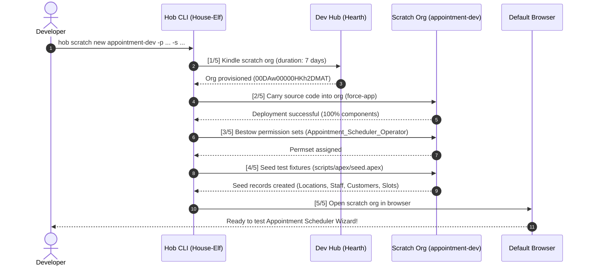

# Part 7: One Command to Rule Them All — The Complete Dev Org Setup with Hob

> *From zero to a fully deployed, permission-assigned, seeded, and tested development environment in a single command: hearth management, scratch org kindling, and lifecycle hygiene.*

---

## Introduction: The Fragmented Gauntlet of Salesforce DX

Throughout Parts 1 through 6, we designed and built the complete **Salesforce Appointment Scheduler** from the ground up:
- Native geolocation data schema and CLI scaffolding ([Part 1](part1.md))
- Least-privilege permission sets without profile sprawl ([Part 2](part2.md))
- Dual in-memory and database test factories ([Part 3](part3.md))
- High-velocity Apex service engines with row-locking concurrency ([Part 4](part4.md))
- Trigger-driven Task generation and email notifications ([Part 5](part5.md))
- Modern 4-step Lightning Web Component booking wizard ([Part 6](part6.md))

At this point, our codebase is feature-complete. But there is a glaring question every development team faces on a Monday morning, when onboarding a new engineer, or when reviewing a pull request:

> **"How long does it take to spin up a clean, working environment from scratch?"**

In the modern web ecosystem (e.g. Next.js, Vite), spinning up a local environment is virtually instantaneous:
```bash
git clone <repo>
npm install
npm run dev
```

In standard Salesforce DX, however, setting up a fresh development scratch org has traditionally required running a tedious gauntlet of disconnected commands:

1. **Kindle the Org**:
   ```bash
   sf org create scratch -f config/project-scratch-def.json -d 7 -a appointment-dev
   ```
   *(Wait 60–90 seconds while monitoring terminal spinners...)*
2. **Deploy Source Metadata**:
   ```bash
   sf project deploy start
   ```
   *(Wait another 60 seconds while objects, classes, and LWCs compile...)*
3. **Assign Permission Sets**:
   ```bash
   sf org assign permset -n Appointment_Scheduler_Operator
   ```
4. **Seed Demo Data**:
   ```bash
   sf apex run --file scripts/apex/seed.apex
   ```
5. **Run Apex Unit Tests**:
   ```bash
   sf apex run test --test-level RunLocalTests --code-coverage
   ```
6. **Open the Org in the Browser**:
   ```bash
   sf org open
   ```

### The Cost of Fragmented Workflows

This manual chain introduces real friction into engineering teams:

* **Context Switching & Idle Waiting**: Developers can't simply run a command and walk away; they must baby-sit each step, waiting for one command to exit before pasting the next.
* **The "Forgotten Step" Bug**: If an engineer forgets Step 3 (permission set), custom objects and tabs are hidden. If they forget Step 4 (seeding), the booking wizard renders empty dropdowns and zero service slots. Diagnosing these missing steps burns valuable engineering time.
* **Dead Ash & Scratch Org Sprawl**: Over weeks of development, developers create dozens of scratch orgs that expire or are abandoned. Local DX authorization files accumulate like dead ashes, cluttering `sf org list` and consuming Dev Hub limits.

In this final chapter, we explore how **[Hob: The Salesforce House-Elf](https://github.com/keesjankoster/hob)** turns this fragmented gauntlet into a single, cohesive developer workflow:
1. **Dev Hub Hearth Care** (`hob hearth`)
2. **The 5-in-1 Pipeline** (`hob scratch new`)
3. **Formatted Test Summaries** (`hob test`)
4. **Automated Scratch Org Purging** (`hob scratch purge`)

---

## 1. Tending the Dev Hub: Lighting & Sweeping the Hearth

In the lore of Hob, the **Dev Hub** is the **Hearth** of your development household. It is the central fire from which all temporary scratch orgs are kindled.

```
       (  )   (   )  )
        ) (   )  (  (
        ( )  (    ) )
       ┌─────────────┐
       │   HEARTH    │  <-- Your Dev Hub (Salesforce Org)
       │  (Dev Hub)  │
       └──────┬──────┘
              │
       Kindles Scratch Orgs
              │
   ┌──────────┴──────────┐
   ▼                     ▼
┌──────────────┐  ┌──────────────┐
│  Scratch #1  │  │  Scratch #2  │
│ (Feature A)  │  │ (Bugfix 102) │
└──────────────┘  └──────────────┘
```

Hob provides dedicated commands to manage, inspect, and tidy your hearth.

### Lighting the Hearth (`hob hearth`)

To connect a new Dev Hub to your machine:

```bash
hob hearth --alias devhub
```

Hob opens your browser to the Salesforce OAuth login portal, links the Dev Hub to your local environment, and sets it as the default kindling source.

### Surveying the Hearths (`hob hearth -l`)

To inspect all authorized Dev Hubs:

```bash
hob hearth -l
```

#### Terminal Output

```
  🧙 Hob — The Salesforce House-Elf 🧦
  "Loyal, quiet, and tireless assistance for your Salesforce Development."

- Hob is checking the hearths...

🧦 Hob found the following hearths (Dev Hubs):

  Alias           Default     Status          Org Id              Username
  ──────────────  ──────────  ──────────────  ──────────────────  ──────────────────────────────
  open            yes         Connected       00DgK00000XmXDBUA3  keesjan.e9473c8f35ea@agentforce.com
```

### Sweeping the Hearth: Pruning Dead Ashes (`hob hearth -c`)

When scratch orgs expire after their 7-day or 30-day lifetime, Salesforce deletes the org in the cloud, but the local CLI retains stale authorization tokens. Running standard `sf org list` warns:

```
Warning: You have 2 expired or deleted local scratch org authorizations.
To remove authorizations for inactive orgs, run "sf org list --clean".
```

Hob sweeps away the dead ashes automatically with a single command:

```bash
hob hearth -c -p
```

```
  🧙 Hob — The Salesforce House-Elf 🧦
  "Loyal, quiet, and tireless assistance for your Salesforce Development."

- Hob is sweeping the hearth: clearing inactive and expired scratch orgs...
√ The hearth is swept clean! Removed inactive scratch org authorizations.

🧦 Hob kept the hearth tidy and free of dead ashes 🧦
```

With `--clean` (`-c`) and `--no-prompt` (`-p`), the hearth is kept pristine with zero interactive prompts.

---

## 2. Kindling a Complete Environment: The 5-in-1 Pipeline

Instead of running 6 separate commands, Hob consolidates scratch org creation, metadata deployment, security assignment, data seeding, and browser launching into a single automated pipeline:

```bash
hob scratch new appointment-dev \
  -p Appointment_Scheduler_Operator \
  -s scripts/apex/seed.apex
```

### The Orchestration Pipeline



### The Live Terminal Output

```
  🧙 Hob — The Salesforce House-Elf 🧦
  "Loyal, quiet, and tireless assistance for your Salesforce Development."

🧦 Hob is preparing to kindle scratch org 'appointment-dev' with a full pipeline...

[1/5] Kindling scratch org 'appointment-dev' (duration: 7 days)...
- Hob is requesting scratch org 'appointment-dev' from the Dev Hub...
√ Scratch org 'appointment-dev' provisioned successfully! (Org ID: 00DAw00000HKh2DMAT)

[2/5] Carrying source code into the scratch org...
- Hob is deploying local source files into the scratch org...
√ Source code deployed successfully to scratch org.

[3/5] Granting permissions in the scratch org...
- Hob is assigning permission set 'Appointment_Scheduler_Operator'...
√ Assigned permission set 'Appointment_Scheduler_Operator'.

[4/5] Sowing test data seeds into the scratch org...
- Hob is executing test data seed 'scripts/apex/seed.apex'...
√ Test data seed 'scripts/apex/seed.apex' applied.

[5/5] Welcoming you into the scratch org...
- Hob is opening your scratch org in the browser...
√ Org opened!

✔ Scratch org 'appointment-dev' is fully kindled and ready!
  Username: test-qbatsqozonab@example.com
  Org ID:   00DAw00000HKh2DMAT

🧦 All chores complete. Hob retreats to the shadows until you need him next 🧦
```

### What Just Happened?

1. **Org Kindling**: Hob validated `config/project-scratch-def.json` and requested the org with the alias `appointment-dev` set as default.
2. **Metadata Deployment**: Hob pushed the entire `force-app` directory (objects, tabs, applications, classes, triggers, and LWCs).
3. **Security Provisioning**: The `Appointment_Scheduler_Operator` permission set was assigned immediately, making all tabs, objects, and field-level security available to the admin user.
4. **Data Seeding**: Hob executed `scripts/apex/seed.apex`, creating realistic compound geolocation branch coordinates, staff shift schedules, and customer contacts.
5. **Instant Access**: The browser launched directly into the authenticated Lightning session.

The developer had to type **one** command, press enter, and return 90 seconds later to an environment fully ready for feature work or QA.

---

## 3. Verifying Application Health: Instant Testing with `hob test`

Once an environment is provisioned, verifying test health is essential. Salesforce CLI's standard `sf apex run test` produces extensive raw tables or verbose JSON output that requires scrolling through hundreds of lines.

Hob streamlines test execution with human-friendly, color-coded summaries:

```bash
hob test
```

### The Terminal Output

```
  🧙 Hob — The Salesforce House-Elf 🧦
  "Loyal, quiet, and tireless assistance for your Salesforce Development."

🧦 Hob is preparing to cast unit test spells for 'Local Tests'...

- Hob is executing Apex tests in Salesforce...

🧪 Test Execution Results:

  Status  Test Name                                                                 Time
  ──────  ────────────────────────────────────────────────────────────────────────  ──────
  ✔ Pass  AvailabilityServiceTest.testGetAvailableSlotsExcludesBookedTimes          301ms
  ✔ Pass  AvailabilityServiceTest.testNoShiftsReturnsEmptyList                       57ms
  ✔ Pass  AvailabilityServiceTest.testNullArgumentsThrowException                     7ms
  ✔ Pass  AppointmentTriggerTest.testCancellationClosesOpenTask                     747ms
  ✔ Pass  AppointmentTriggerTest.testDefaultStatusEnforced                           313ms
  ✔ Pass  AppointmentTriggerTest.testDeleteCompletedAppointmentPrevented             134ms
  ✔ Pass  AppointmentTriggerTest.testTaskCreatedOnAppointmentInsert                 327ms
  ✔ Pass  CustomerServiceTest.testCreateCustomerMissingLastName                      14ms
  ✔ Pass  CustomerServiceTest.testCreateCustomerSuccess                              84ms
  ✔ Pass  CustomerServiceTest.testGetCustomerById                                    37ms
  ✔ Pass  CustomerServiceTest.testSearchCustomersByPostalCode                       35ms
  ✔ Pass  CustomerServiceTest.testSearchCustomersByTerm                              40ms
  ✔ Pass  AppointmentServiceTest.testBookAppointmentSuccess                         513ms
  ✔ Pass  AppointmentServiceTest.testCancelAppointment                               534ms
  ✔ Pass  AppointmentServiceTest.testCustomerDoubleBookingPrevented                 514ms
  ✔ Pass  AppointmentServiceTest.testInvalidTimeThrowsException                      62ms
  ✔ Pass  AppointmentServiceTest.testStaffDoubleBookingPrevented                     315ms
  ✔ Pass  LocationServiceTest.testCalculateHaversineDistanceKm                         18ms
  ✔ Pass  LocationServiceTest.testGetNearestLocationsProximity                       128ms
  ✔ Pass  LocationServiceTest.testGetNearestLocationsServiceFiltering                 82ms
  ✔ Pass  LocationServiceTest.testNullServiceTypeThrowsException                      9ms

📊 Apex Code Coverage:

  Class Name                  Coverage Bar            % Lines (Cov/Total)  Uncovered Lines
  ──────────────────────────  ──────────────────────  ─────  ────────────────  ────────────────────
  AppointmentService          [█████████████████░]  92%           (44/48)  None
  CustomerService             [█████████████████░]  95%           (42/44)  None
  LocationService             [█████████████████░]  92%           (81/88)  None
  AppointmentTriggerHandler   [█████████████████░]  93%         (111/120)  None
  AvailabilityService         [█████████████████░]  93%           (79/85)  None
  AppointmentTrigger          [██████████████████] 100%             (4/4)  None

  Test Run Coverage:  93% (Minimum requirement: 75%) ✔
  Org-Wide Coverage:  92%

  ────────────────────────────────────────────────────────────
  Total: 26 | Passed: 26 | Failed: 0 | Skipped: 0 | Duration: 2.1s
  ────────────────────────────────────────────────────────────

✔ All Apex tests passed successfully in 2.1s!

🧦 Hob tidied up the test suite and polished your code coverage reports! 🧦
```

To run a specific test suite or drill down into uncovered lines:

```bash
hob test CustomerServiceTest --detailed
```

---

## 4. Lifecycle Hygiene: Scratch Org Purging (`hob scratch purge`)

Scratch orgs are meant to be ephemeral. Leaving dozens of stale scratch orgs active consumes the daily active scratch org limit of your Dev Hub (typically 3 for Developer Edition hubs, 40 for Enterprise).

Hob includes a built-in purge command to sweep away expired and unwanted scratch orgs safely:

### 1. Dry Run Inspection (`--dry-run`)

Before deleting anything, preview what would be removed:

```bash
hob scratch purge --dry-run
```

```
  🧙 Hob — The Salesforce House-Elf 🧦
  "Loyal, quiet, and tireless assistance for your Salesforce Development."

- Hob is scanning the hearth for disposable scratch orgs...

  Found 2 expired scratch orgs:
  - test-q34k1 (Expired 2 days ago, Org ID: 00DAw00000HKa01)
  - temp-fix-2 (Expired yesterday,  Org ID: 00DAw00000HKb02)

[Dry Run] No orgs were deleted. Run without --dry-run to purge.
```

### 2. Purging Expired Orgs

```bash
hob scratch purge --expired-only --no-prompt
```

```
- Hob is purging expired scratch orgs from the Dev Hub...
√ Deleted scratch org 'test-q34k1'
√ Deleted scratch org 'temp-fix-2'

🧦 The hearth is clean and uncluttered! 🧦
```

---

## 5. Architectural Retrospective: The Complete Journey

Across this 7-part series, we took a blank Git repository and built an enterprise-grade appointment booking platform on Salesforce.

Here is how each layer of the application maps to the Hob development lifecycle:

| Layer | Component | Architecture Highlights | Scaffolding Command |
| :--- | :--- | :--- | :--- |
| **1. Data Model** | `Appointment__c`, `Service_Type__c`, `Staff_Working_Hours__c` | Native geolocation compound fields (`ShippingAddress`), AutoNumber `APT-{0000}`, Shift `Time` fields. | `hob create object`<br/>`hob create field` |
| **2. Security** | `Appointment_Scheduler_Operator` | Strict least-privilege permission set, zero profile bloat, explicit FLS, RecordType visibility. | `hob create permset` |
| **3. Test Hygiene** | `*DataFactory.cls`, `seed.apex` | Dual in-memory (`build`) vs database (`create`) pattern to avoid governor limits, demo seeding fixtures. | `hob create factory`<br/>`hob seed init` |
| **4. Domain Services** | `CustomerService`, `LocationService`, `AvailabilityService`, `AppointmentService` | Transactional concurrency with `FOR UPDATE` row-locking, Haversine proximity calculations, TDD test companions. | `hob create apex --with-test` |
| **5. Automation** | `AppointmentTrigger`, `AppointmentTriggerHandler` | Logic-less triggers, `System.TriggerOperation` dispatching, standard `Task` generation, customer emails. | `hob create trigger` |
| **6. Lightning UI** | `appointmentWizard` + 4 child components, App & Tabs | Container/subcomponent state machine, live context pills, modern SLDS layout, Lightning App bundle. | `hob create lwc -t app tab` |
| **7. Org Lifecycle** | Dev Hub Hearth, Scratch Pipeline, Testing, Purge | End-to-end kindling pipeline, automatic permset assignment, seed script execution, test summaries. | `hob hearth`<br/>`hob scratch new`<br/>`hob test`<br/>`hob scratch purge` |

---

## 6. DX Verdict & Tool Feedback

### What Shined

1. **Frictionless Zero-to-App Setup**:
   `hob scratch new <alias> -p <permset> -s <script>` solves the single largest pain point in Salesforce DX: the multi-command orchestration barrier. Being able to run one command and come back to a fully deployed and seeded org is a massive productivity boost.
2. **Cohesive Metaphor & Delightful DX**:
   The House-Elf theme (lighting the hearth, sweeping dead ashes, carrying source files, kindling orgs) brings personality to what is traditionally dry DevOps plumbing. The terminal output is clean, informative, and engaging.
3. **Built-in Quality Gates**:
   Pairing `hob scratch new` with `hob test` provides an immediate verification loop that can be integrated directly into local developer routines or CI/CD pipelines.

### Opportunities for Hob's Backlog

1. **Project Configuration File (`.hobrc` or `hob.config.json`)**:
   - Currently, developers must pass `-p Appointment_Scheduler_Operator` and `-s scripts/apex/seed.apex` on every invocation.
   - Allowing a `.hobrc.json` file in the project root:
     ```json
     {
       "scratch": {
         "defaultDuration": 7,
         "permissionSets": ["Appointment_Scheduler_Operator"],
         "seedScript": "scripts/apex/seed.apex",
         "defaultApp": "Appointment_Scheduler"
       }
     }
     ```
     would allow developers to simply run `hob scratch new appointment-dev` with zero additional flags.
2. **Shorthand Flag Conflict with Root `--version` (`-v`)**:
   - Commander.js assigns `-v` to `--version` at the root CLI level. When `hob scratch new -v devhub` is executed, the root `-v` flag can intercept the parameter and output the version number (`0.1.0`) instead of parsing `--target-dev-hub`.
   - Recommending `--target-dev-hub` or aliasing Dev Hub flag to `-V` / `-H` (`--hub`) in Hob CLI avoids this Commander parser collision.
3. **Post-Kindling Hooks**:
   - Supporting custom post-creation hooks (such as running `npm test` or a custom script after seeding) would provide complete CI/CD automation flexibility.

---

## 7. Conclusion

Modern Salesforce development does not have to mean wrestling with XML files, clicking through Setup menus, or babysitting 6-step terminal commands.

With clear architectural separation of concerns and an intelligent CLI companion like **Hob: The Salesforce House-Elf**, building enterprise applications on the Salesforce platform can be as fast, modular, and enjoyable as any modern web stack.

Every line of code, configuration, test factory, and automation created throughout this series is available in the **[Salesforce Appointment Scheduler](https://github.com/keesjankoster/salesforce-appointment-scheduler)** repository.

Happy coding, and may your hearth always burn bright! 🧦
